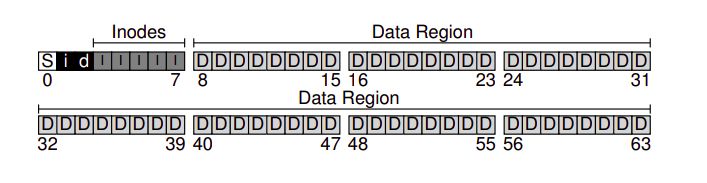

# Topics 

# 1. Datastructure and algorithm


# 2. Operating system
## 2.1 Process and thread
### *Process allocate memory and start*
### *Process transfer control*
### *Process switch context*
### *Lock*
### *Scheduling*
### *Interprocess communication*
### *Concurrency*

## 2.2 Memory management 
### Memory management

### Virtual memory

- **Translation lookaside buffer**:

A translation lookaside buffer is a memory cache that is used to reduce the time taken to access a user memory location. It is a part of the chip's memory-management unit. The TLB stores the recent translations of virtual memory to physical memory and can be called an address-translation cache.

### Paging

## 2.3 File system

Simple file system



- **Super block**

Super block store information about file system type, how many inodes and data block in system, where does the inode table start?

When start OS will read the supper block first and then initialize the file system

- **Inode bitmap and data bitmap**

Bitmap is used to indicate whether the coresponding object (inode or data block) is free or allocated

- **INode table**

Inode table tracking meta data of file such as size of file, owner, created time, access right 

- **Data region**


- **Directory**

Data block of directory contain list of pair of name and the inode number of that item


# 3. Networking
## 3.1 TCP
- How TCP works?
```
this is how TCP work
```
## 3.2 UDP
## 3.3 HTTP
## 3.4 HTTPs
1. How https works?
2. Certificate authority
## 3.4 Network programming


# Security
## How https works?

## How to store password?
 - dont store raw -> store hash
 - dont use md5 -> use bcrypt
 - careful about sql injection


## JWT

- [JWT HS256 vs RS256](https://stackoverflow.com/a/39239395/2803909)

# Database
- Complexity of SQL queries 
``` 

```
- Left Join
```
```
- Index and their implementation
```
```
- Composite index and their implementation
```
```
# MySQL

# Large scale distributed system

# Java

- Bit manifestation
```
Java unsigned shift bit: >>>
Java signed shift bit: >>
```

# Behavioral question

1. Do you have any experience?
1. When did you start programming?
1. Did you ever interview at any other company? 
1. What will you do if Google suddenly asks me to join them? Will you leave Garena?
1. What is your opinion about overtime work?
1. What is your opinion about meetings?
1. What is your expected salary?
1. What is your opinion about the interview process?
1. Do you know what Garena does?
1. Why do you want to work here?


# References
- [Interview with shopee garena](https://forthright48.com/interview-with-shopee-garena/)
- [Operating system: the three easy pieces](http://pages.cs.wisc.edu/~remzi/OSTEP/)